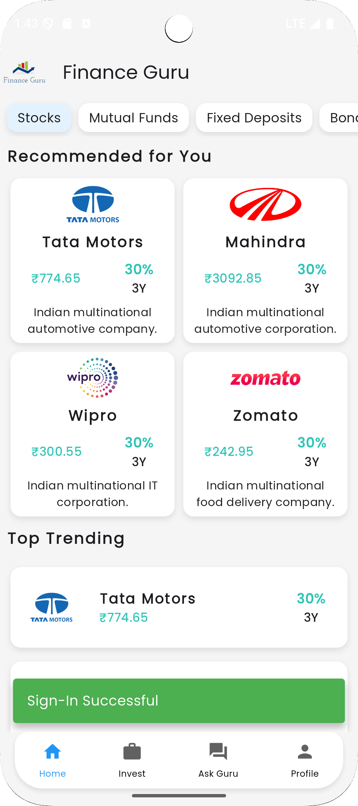
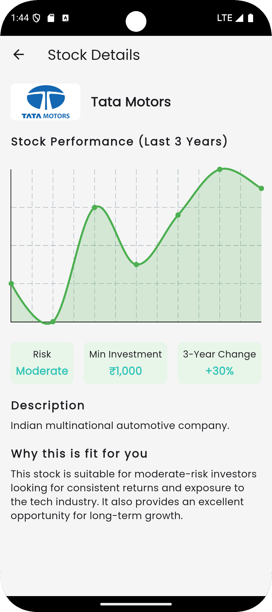
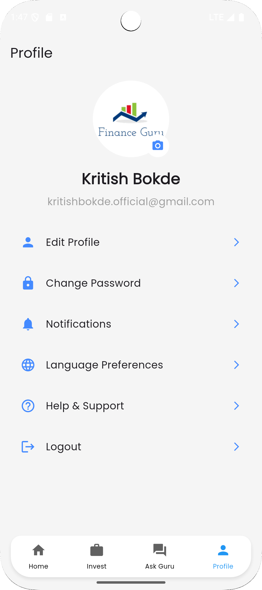

# Finance_guru
Recommend you to Zoom out the Screen by pressing Crtl + "-" to have the best experience io the UI
# UI Design of the Fiance Guru 
we created a user-friendly app that provides personalized financial guidance by:​

	1. Savings Calculator: Calculates savings based on user inputs like salary, marital status, tax obligations, and risk level.​

	2. Investment Recommendations: Suggests tailored plans for shares, mutual funds, FDs, and bonds.​

	3. Chatbot: Answers FinTech queries and provides financial education.​

	4. Real-time Insights: Displays top investment plans and news to keep users informed.
---
## Sign-in

## Landing Page

## Dashboard 

## Our Savings Calculator

## Ask Guru (Chart Bot)

## Profile Page

## Getting Started

This project is a starting point for a Flutter application.

A few resources to get you started if this is your first Flutter project:

- [Lab: Write your first Flutter app](https://docs.flutter.dev/get-started/codelab)
- [Cookbook: Useful Flutter samples](https://docs.flutter.dev/cookbook)

For help getting started with Flutter development, view the
[online documentation](https://docs.flutter.dev/), which offers tutorials,
samples, guidance on mobile development, and a full API reference.
