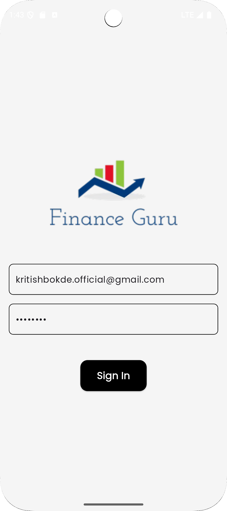

# Finance_guru
Recommend you to Zoom out the Screen by pressing Crtl + "-" to have the best experience io the UI
# UI Design of the Fiance Guru 
---
## Sign-in

## Landing Page

## Dashboard 

## Recommendation UI 

## Chart Bot 

## Profile Page

## Getting Started

This project is a starting point for a Flutter application.

A few resources to get you started if this is your first Flutter project:

- [Lab: Write your first Flutter app](https://docs.flutter.dev/get-started/codelab)
- [Cookbook: Useful Flutter samples](https://docs.flutter.dev/cookbook)

For help getting started with Flutter development, view the
[online documentation](https://docs.flutter.dev/), which offers tutorials,
samples, guidance on mobile development, and a full API reference.
